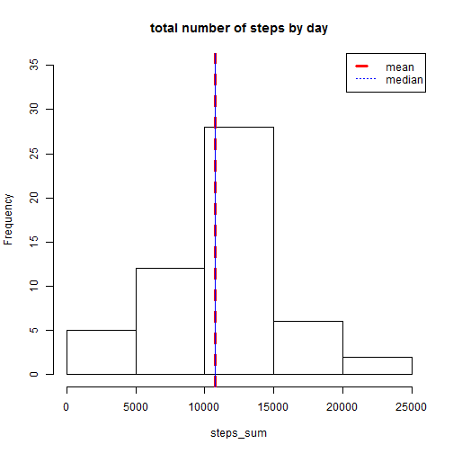
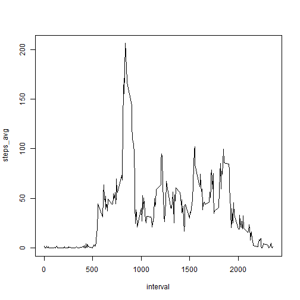
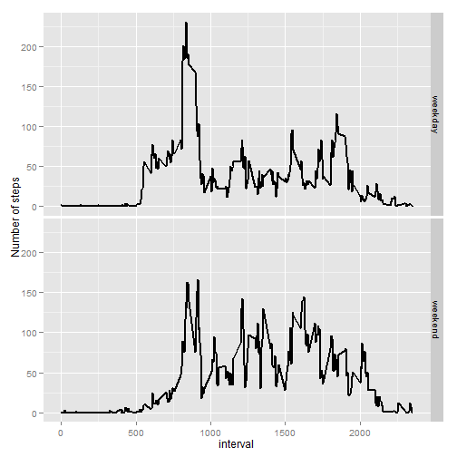

# Reproducible Research: Peer Assessment 1


## Loading and preprocessing the data

```r
activity <- read.csv(unz("activity.zip", "activity.csv"))
activity$date <- as.Date(as.character(activity$date))
```


## What is mean total number of steps taken per day?

```r
library(plyr)
StepsByDay <- ddply(activity, .(date), summarize, steps_sum = sum(steps))
plothist <- function(df, main) {
    with(df, hist(steps_sum, ylim = c(0, 35), main = main))
    mean <- with(df, mean(steps_sum, na.rm = TRUE))
    median <- with(df, median(steps_sum, na.rm = TRUE))
    abline(v = mean, col = "red", lty = 2, lw = 3)
    abline(v = median, col = "blue")
}
plothist(StepsByDay, "total number of steps by day")
legend("topright", col = c("red", "blue"), lty = c(2, 3), lw = c(3, 1), legend = c("mean", 
    "median"))
```

 


```r
sprintf("%.2f", with(StepsByDay, mean(steps_sum, na.rm = TRUE)), 2)
with(StepsByDay, median(steps_sum, na.rm = TRUE))
```

mean total number of steps taken per day is :
**10766.19**  
median total number of steps taken per day is :
**10765** 

## What is the average daily activity pattern?

```r
AvgStepsByInterval <- ddply(activity, .(interval), summarize, steps_avg = round(mean(steps, 
    na.rm = TRUE), 2))
with(AvgStepsByInterval, plot(interval, steps_avg, type = "l"))
```

 


```r
AvgStepsByInterval[AvgStepsByInterval$steps_avg == max(AvgStepsByInterval$steps_avg), 
    "interval"]
```


The 5-minute interval, on average across all the days in the dataset, that contains the maximum number of steps is:
**835**

## Imputing missing values

```r
r missing<-is.na(activity$steps)
sum(missing)
```


The total number of missing values in the dataset is:
**2304**   

For filling in all of the missing values in the dataset: we create the function `FillNa` to replace the missing values of steps by the mean of steps for the corresponding 5-minute interval across all days.  
These averaged values are already calculated in `AvgStepsByInterval` dataset.  


```r
FillNa <- function() {
    DF <- activity
    for (i in which(missing)) {
        intrv5 <- DF[i, "interval"]
        DF[i, "steps"] <- AvgStepsByInterval[AvgStepsByInterval$interval == 
            intrv5, "steps_avg"]
    }
    return(DF)
}
```

  
  
We create a new dataset that is equal to the original dataset but with the missing data filled in.  
We create a two histograms of the total number of steps taken each day, to compare the values of mean and median between the dataset with missing values, and the dataset with the missing data filled in.  
  

```r
activityFill <- FillNa()
StepsByDayNomiss <- ddply(activityFill, .(date), summarize, steps_sum = sum(steps))
par(mfrow = c(1, 2))
plothist(StepsByDay, "With NAs")
plothist(StepsByDayNomiss, "NAs Filled in")
legend("topright", col = c("red", "blue"), lty = c(2, 3), lw = c(3, 1), legend = c("mean", 
    "median"))
```

 


```r
sprintf("%.2f", with(StepsByDay, mean(steps_sum, na.rm = TRUE)))
sprintf("%.2f", with(StepsByDay, median(steps_sum, na.rm = TRUE)))
sprintf("%.2f", with(StepsByDayNomiss, mean(steps_sum, na.rm = TRUE)))
sprintf("%.2f", with(StepsByDayNomiss, median(steps_sum, na.rm = TRUE)))
```

**For the datasets with NAs:**    
mean total number of steps taken per day is :
**10766.19**  
median total number of steps taken per day is :
**10765.00**  
  
**For the datasets with missing values filled in:**  
mean total number of steps taken per day is :
**10766.18**  
median total number of steps taken per day is :
**10766.13** 

We can see that the values for the mean and median remained almost unchanged.  
We can confirm that our strategy to fill the missing values in this data has no impact on the estimates of the total daily number of steps.
## Are there differences in activity patterns between weekdays and weekends?

We create a new factor variable in the dataset with two levels - "weekday" and "weekend" indicating whether a given date is a weekday or weekend day.  
We Make a panel plot containing a time series plot of the 5-minute interval (x-axis) and the average number of steps taken, averaged across all weekday days or weekend days (y-axis).  

```r
activityTday <- activityFill
activityTday$days <- weekdays(activityFill$date)
days <- c("Saturday", "Sunday", "Monday", "Tuesday", "Wednesday", "Thursday", 
    "Friday")
TypeDay <- c(rep("weekend", 2), rep("weekday", 5))
daysFlag <- data.frame(days, TypeDay)
daysFlag$days <- as.character(daysFlag$days)
activityTday <- join(activityTday, daysFlag, by = "days")
# 2.Make a panel plot
AvgStepsByIntTday <- ddply(activityTday, .(TypeDay, interval), summarize, steps_avg = round(mean(steps, 
    na.rm = TRUE), 2))
library(ggplot2)
# qplot(interval,steps_avg,data=AvgStepsByIntTday,facets=TypeDay ~
# .,geom=('line'),ylab='Number of steps')
ggplot(AvgStepsByIntTday, aes(interval, steps_avg)) + geom_line(size = 1) + 
    facet_grid(TypeDay ~ .) + labs(y = "Number of steps")
```

 


By binding the sum of steps to the physical activity, we can see that on weekends the activity starts later on and is more regularly distributed accross the day, while in weekdays the activity starts earlier with two relevant peaks at the start and the end of the day.
